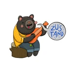

## 👋

<!--
**SOOMin13/SOOMin13** is a ✨ _special_ ✨

Here are some ideas to get you started:

- 🔭 I’m currently working on ...
- 🌱 I’m currently learning ...
- 👯 I’m looking to collaborate on ...
- 🤔 I’m looking for help with ...
- 💬 Ask me about ...
- 📫 How to reach me: ...
- 😄 Pronouns: ...
- ⚡ Fun fact: ...
-->

안녕하세요, 프론트엔드 개발자 손수민입니다!

<!-- ## 👩🏻‍💻 Career & Experience

| Name                               | Organization                          | Date                               | Description                                                                                               |
| ---------------------------------- | ------------------------------------- | ---------------------------------- | --------------------------------------------------------------------------------------------------------- |
| 합동 프로젝트  프론트엔드 팀장 | OZ Codeing School                     | 2024.11 ~                          | 사업 개발, 프론트엔드, 백엔드 3팀이 함께하는 합동 프로젝트에서  프론트엔드 팀장을 맡아 역할을 수행함. |
| 프론트엔드  초격차 부트캠프    | OZ Codeing School                     | 2024.06 ~                          | 프론트엔드 개발자로 진로 전환을 위한 새로운 도전!                                                         |
| 간호사 면허 취득                   | 보건복지부                            | 2024.03.12                         | 간호사 국가고시 합격, 학사 학위 취득 후 면허증 수여받음.                                                  |
| 성적 우수 장학                     | 대구보건대학교  간호대학 간호학과 | 2022년도 1학기, 2019년도 1학기 | 총 2번의 성적장학 수혜 경험                                                                               |
| 학술대회 우수상                    | 대구보건대학교  간호대학 간호학과 | 2021.10.05                         | 간호대학 학술대회에서 우수상 수상                                                                         | -->

#### 🛠️ Tech Stack

 

 
 

 
 

 

#### 🌱 Github stats

